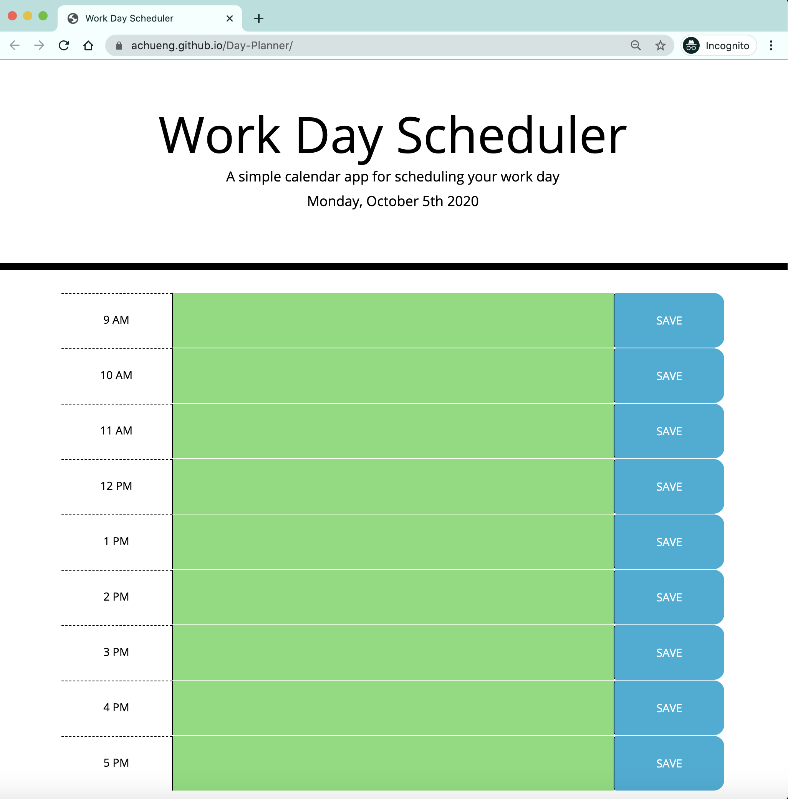

# Day-Planner
This project's objective is to create a Day Planner

**Deployed Page:** https://achueng.github.io/Day-Planner/

Preview of Deployed Page

### Project Details

This project was written with HTML, CSS, & JavaScript, while also creating a dynamic experience for the user by utilizing 3 Application Programming Interfaces (API): Bootstrap, jQuery, and Moment.js.

When the user inputs something on the day planner and clicks the SAVE button, the text stays on the page. After leaving or refreshing the page the previously inputted text still shows. 

The color of each time block changes based on the current hour. The current hour is in red, past hours are in grey, and future hours are in green.